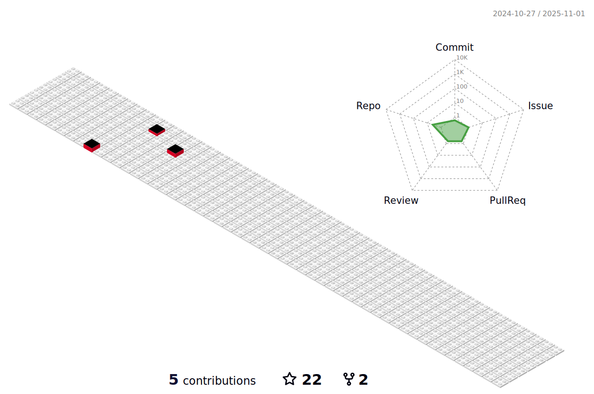

 

### :man_technologist: I'm Harshill Kumar and I'm interested in software and web development
Currently I'm learning and practicing web development and data structures algorithms,

 
<h2>Social Networks</h2>

[![Twitter][1.2]][1] [![LinkedIn][2.2]][2] [![Instagram][3.2]][3] [![Telegram][4.2]][4] [![Discord][5.2]][5]

[1.2]: https://s4.uupload.ir/files/twitter_prkb.png
[2.2]: https://s4.uupload.ir/files/linkedin_amwn.png
[3.2]: https://s4.uupload.ir/files/instagram_6djz.png
[4.2]: https://s4.uupload.ir/files/telegram_q47u.png
[5.2]: https://skillicons.dev/icons?i=discord

[1]: https://twitter.com/HarshillK
[2]: https://www.linkedin.com/in/harshiilll/
[3]: https://www.instagram.com/harshiilll
[4]: http://telegram.me/harshiilll
[5]: https://discordapp.com/users/598736886705422347

 
<h2>Skills</h2>

  

  

  
<b>:gear: &nbsp;Git statistics</b>

  
  
 
 
 
 

